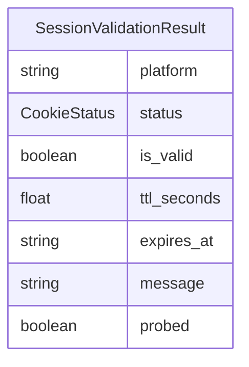

# Entity-Relationship Diagram

> Auto-generated by UCBDDManager ERDGenerator.
> Source hash: 35c4d2779e3eee2cd47d2b4ef8f4d47fd50efc096ea204ea3f412c008333167e

```mermaid
erDiagram
    SessionValidationResult {
        string platform
        CookieStatus status
        boolean is_valid
        float ttl_seconds
        string expires_at
        string message
        boolean probed
    }
```